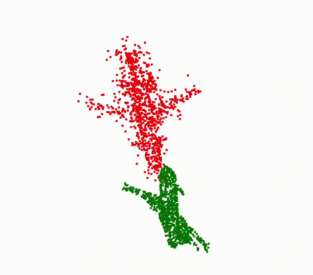

# ESM_ICP

**ESM_ICP** is a C++ implementation of the Enhanced Soft Matching Iterative Closest Point (ESM-ICP) algorithm for point cloud registration. This repository provides tools for aligning 3D point clouds using the ESM-ICP method.
<table>
  <tr>
    <td></td>
    <td></td>
  </tr>
  <tr>
    <td></td>
    <td></td>
  </tr>
</table>


## Features

- Implementation of the ESM-ICP algorithm for precise point cloud registration.
- Visualization tools for analyzing registration results.
- Modular code structure for easy integration and extension.

## Getting Started

### Prerequisites

- C++17 compatible compiler
- [Eigen](https://eigen.tuxfamily.org/) library
- [PCL (Point Cloud Library)](https://pointclouds.org/) (optional, for visualization)

### Building the Project

1. Clone the repository:

   ```bash
   git clone --recurse-submodules https://github.com/aralab-unr/ESM_ICP.git
   cd ESM_ICP
   mkdir build
   cd build
   cmake ..
   make

2. Usage

    ```bash
      ./ESM_ICP_deo_Viewer <source.pcd> <method> <leaf_size> <outlier_percent>
      for example,
     ./ESM_ICP_demo_Viewer ../../datasets/ModelNet40_pcd/stool/test/stool_0092.pcd icp 0.009 0.0f
   
