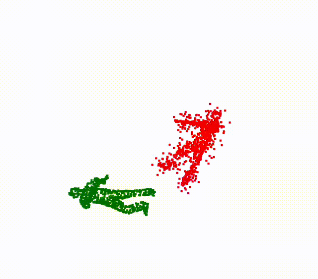

# ESM_ICP

**ESM_ICP** is a C++ implementation of the Enhanced Soft Matching Iterative Closest Point (ESM-ICP) algorithm for point cloud registration. This repository provides tools for aligning 3D point clouds using the ESM-ICP method.
<table>
  <tr>
    <td></td>
    <td></td>
  </tr>
  <tr>
    <td></td>
    <td></td>
  </tr>
</table>


## Features

- Implementation of the ESM-ICP algorithm for precise point cloud registration.
- Visualization tools for analyzing registration results.
- Modular code structure for easy integration and extension.

## Getting Started

### Prerequisites

- C++17 compatible compiler
- [Eigen](https://eigen.tuxfamily.org/) library
- [PCL (Point Cloud Library)](https://pointclouds.org/) (optional, for visualization)

### Building the Project

1. Clone the repository:

   ```bash
   git clone --recurse-submodules https://github.com/aralab-unr/ESM_ICP.git
   cd ESM_ICP
   mkdir build
   cd build
   cmake ..
   make

2. NOTE: Create folder res/ and saved_pcd/ in you cloned repository (this is for logging purposes), other wise the program crashes OR in the code ESM_ICP_demo_Viewer.cpp comment out the lines which are logging in data in these folder.
   
3. Usage

    ```bash
      ./ESM_ICP_deo_Viewer <source.pcd> <method> <leaf_size> <outlier_percent>
      for example,
     ./ESM_ICP_demo_Viewer ../../datasets/ModelNet40_pcd/stool/test/stool_0092.pcd icp 0.009 0.0f
   
    <method> can be icp, gicp, icp_nl, point2plane, ndt, goicp, deepgmr, dcp, pointnetlk and rpmnet.
    <outlier_percent> denotes how much percent of points do you want the source to be affected by noise.
   
4. If you want to use GO-ICP go to the GOICP folder and do mkdir build, cd  build, cmake .. and make.
5.  IMP NOTES:
     - The 'method' is used only for comparison with ESM-ICP. In the viewer's left view, the ouput is always from ESM-ICP and in the right view the output is from the method you pick.
     - The code randomly generates a transformation using the function generateRandomTransformation() and transfroms the loaded point point cloud.
     - ESM-ICP perfroms alignment on the original and the transformed point cloud along with other methods for comaprison.
     - Honestly, the actual implmentation is in the function "Eigen::Matrix4d computeOptimalTransformation(const PointCloudT::Ptr& source, const PointCloudT::Ptr& target, const std::vector<int>& correspondences)", the remaining are just codes for comparison with other methods and can be safely ignored.
     - just focus on the ESM_ICP_demo_Viewer.cpp , the remaining cpp files are for testing purposes only.
     - GPU implementation is still under process.
